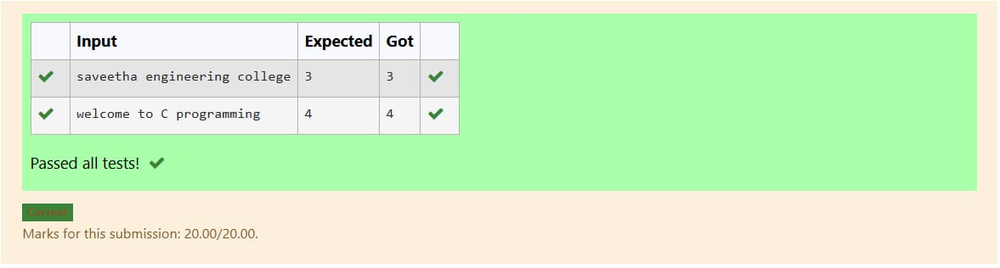

# EX-16-LEFT-SHIFT-OPERATION
## AIM:
To write a C Program to perform the basic left shift operation for 44 integer number with 3 shifts.

## ALGORITHM:
1.	Start the program.
2.	Assign values of a and b as 44 and 3.
3.	Use left shift operator (<<) and shift the value of a three times.
4.	Display the result.
5.	Stop the program.

## PROGRAM:
```
#include <stdio.h>

int main() {
    int number = 44; // The integer to be shifted
    int shifts = 3;  // The number of positions to shift left
    int result;      // Variable to store the result

    // Perform the left shift operation
    result = number << shifts;

    // Print the original number, the number of shifts, and the result
    printf("Original number: %d\n", number);
    printf("Number of left shifts: %d\n", shifts);
    printf("Result after left shifting: %d\n", result);

    return 0;
}
```


## OUTPUT:


## RESULT:
Thus the program to perform the basic left shift operation for 44 integer number with 3 shifts has been executed successfully.


 
 


# EX-17-TWO-NUMBERS-ARE-EQUAL-OR-NOT


## AIM:

Write a C Program to check whether the two numbers are equal or not using simple if statement.

## ALGORITHM:

1.	Start the program.
2.	Read two numbers.
3.	If first number is equal to second number, display both are equal.
4.	Otherwise display both are not equal.
5.	Stop the program.

## PROGRAM:
```
#include <stdio.h>

int main() {
    int num1, num2;

    // Prompt the user to enter the first number
    printf("Enter the first number: ");
    // Read the first number from the user
    scanf("%d", &num1);

    // Prompt the user to enter the second number
    printf("Enter the second number: ");
    // Read the second number from the user
    scanf("%d", &num2);

    // Check if the two numbers are equal using the '==' operator
    if (num1 == num2) {
        printf("The two numbers are equal.\n");
    } else {
        printf("The two numbers are not equal.\n");
    }

    return 0; // Indicate successful program execution
}
```


## OUTPUT:

           
## RESULT:

Thus the program to check whether the two numbers are equal or not using simple if statement has been executed successfully
 
 


# EX-18-STRING-LOWERCASE-CONVERSION
## AIM:
Write a C Program to convert the given string into lowercase.

## ALGORITHM:
1.	Start the program.
2.	Read a string variable.
3.	Using tolower( ) function convert the given string into its lowercase.
4.	Display the result.
5.	Stop the program.

## PROGRAM:
```
#include <stdio.h>
#include <ctype.h> // Required for the tolower() function
#include <string.h> // Required for the strlen() function (optional, can use null terminator check)

int main() {
    char str[100]; // Declare a character array to store the string

    printf("Enter a string: ");
    fgets(str, sizeof(str), stdin); // Read the string from the user, including spaces

    // Remove the trailing newline character if present from fgets
    str[strcspn(str, "\n")] = 0; 

    // Iterate through the string and convert each character to lowercase
    for (int i = 0; str[i] != '\0'; i++) {
        str[i] = tolower(str[i]); // Convert character to lowercase using tolower()
    }

    printf("Lowercase string: %s\n", str); // Print the converted string

    return 0;
}
```

## OUTPUT:




## RESULT:
Thus the program to convert the given string into lowercase has been executed successfully
 
 


# EX-19-COUNT-OF-WORDS-IN-A-STRING
## AIM:
Write a C Program to count the total number of words in a given string using do While loop.

## ALGORITHM:
1.	Start the program.
2.	Read a string variable.
3.	Using for loop, inspect the string character by character.
4.	Whenever a space is encountered increment count by 1.
5.	Display the result.
6.	Stop the program.

## PROGRAM:
```
#include <stdio.h>
#include <string.h> // Required for strlen()

int main() {
    char str[100]; // Declare a character array to store the string
    int i = 0;
    int word_count = 0;
    int in_word = 0; // Flag to track if currently inside a word (1) or not (0)

    printf("Enter a string: ");
    fgets(str, sizeof(str), stdin); // Read the string including spaces

    // Remove the trailing newline character if present from fgets
    str[strcspn(str, "\n")] = 0;

    // Handle empty string case
    if (strlen(str) == 0) {
        printf("Total number of words: 0\n");
        return 0;
    }

    do {
        // If the current character is a whitespace character
        if (str[i] == ' ' || str[i] == '\t' || str[i] == '\n') {
            in_word = 0; // Not inside a word
        } 
        // If the current character is not a whitespace and we were not in a word before
        else if (in_word == 0) {
            word_count++; // Increment word count
            in_word = 1;  // Now we are inside a word
        }
        i++;
    } while (str[i] != '\0'); // Loop until the null terminator is reached

    printf("Total number of words: %d\n", word_count);

    return 0;
}
```

## OUTPUT:


## RESULT:
Thus the program to count the total number of words in a given string using do While loop has been executed successfully
 
 


# EX  -20 -COMPARING TWO STRINGS
## AIM:
write a Program to compare two strings without using strcmp().
## ALGORITHM:
Step 1: Start the program.
Step 2: Declare two character arrays c1 and c2 of size 100 to store the strings. Also, declare an integer variable
             flag and initialize it to 0, and i for indexing.      
Step 3: Read the first string c1 using scanf("%[^\n]", c1); — this reads input until a newline is encountered 
            (i.e., can include spaces).
Step 4: Read the second string c2 using scanf("%s", c2); — this reads input until a space or newline (i.e., no 
            spaces in the second string).
Step 5: Start comparing characters of both strings from index i = 0.
Step 6: Repeat the following while neither c1[i] nor c2[i] is '\0' (i.e., end of string):
•	If c1[i] is not equal to c2[i], set flag = 1.
•	Increment i by 1.
Step 7: After the loop, check the value of flag:
•	If flag == 0, print "strings are same".
•	Otherwise, print "strings are not same".
Step 8: End the program.

## PROGRAM:
```
#include <stdio.h>
#include <stdbool.h> // For using bool type

// Function to compare two strings
int custom_strcmp(const char *str1, const char *str2) {
    int i = 0;
    // Iterate while both strings have characters and they are equal
    while (str1[i] != '\0' && str2[i] != '\0' && str1[i] == str2[i]) {
        i++;
    }

    // If characters at current position are different, return their difference
    if (str1[i] != str2[i]) {
        return str1[i] - str2[i];
    } else {
        // If one string ended and the other also ended, they are equal
        // If one ended and the other did not, the longer one is "greater"
        return 0; // Strings are equal
    }
}

int main() {
    char string1[100];
    char string2[100];

    printf("Enter the first string: ");
    scanf("%s", string1);

    printf("Enter the second string: ");
    scanf("%s", string2);

    int result = custom_strcmp(string1, string2);

    if (result == 0) {
        printf("The two strings are equal.\n");
    } else if (result < 0) {
        printf("String 1 is lexicographically smaller than String 2.\n");
    } else {
        printf("String 1 is lexicographically larger than String 2.\n");
    }

    return 0;
}
```


## OUTPUT:

 

## RESULT:
Thus the C Program to compare two strings without using strcmp() has been executed successfully.

